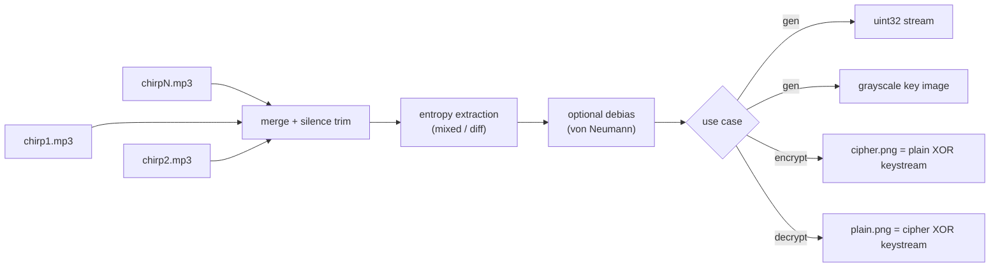
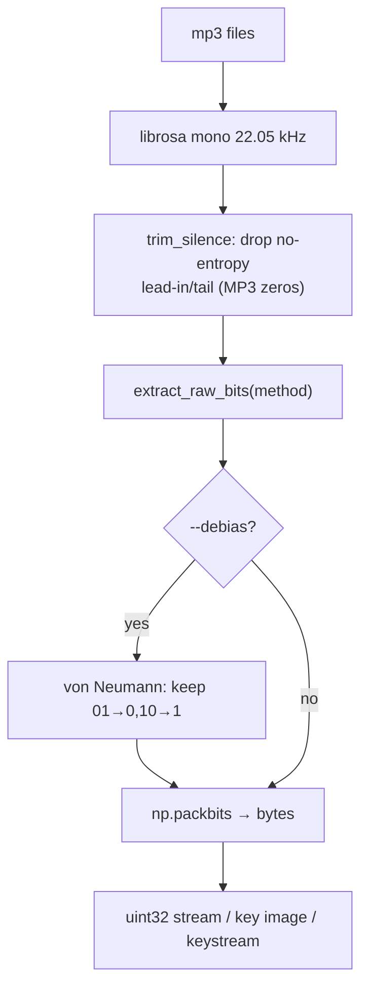

# audio-trng

**True Random Number Generator from natural audio (bird chirps) — with image encryption demo.**

Randomness comes **only** from physical processes in the signal: ADC quantization
noise, environmental noise, and non-stationary content. There is **no
cryptographic conditioning** (no SHA-256) anywhere in the pipeline — the raw
extracted bits pass the statistical tests on their own, so the randomness is
attributable to the extraction method, not a hash.

## What it does



## Why no SHA-256?

A hash can turn *anything* (even a deterministic pattern) into random-looking
output — so conditioning would make the result indistinguishable from a PRNG
and the physical source would be irrelevant. Here the **method** must do the
work: `mixed` / `diff` extraction passes frequency, runs, autocorrelation, and
byte-uniformity tests on raw bits from real recordings. Namely:

| method | raw monobit | raw runs | raw autocorr | raw byte-uniformity |
|---|---|---|---|---|
| `mixed` (default) | PASS | PASS | PASS | PASS |
| `diff` | PASS | PASS | PASS | PASS |
| `lsb` | FAIL | FAIL | PASS | FAIL |
| `adc_noise` | FAIL | FAIL | PASS | PASS |
| `zero_cross` | FAIL | FAIL | FAIL | FAIL |

Weak methods are honestly reported and recoverable in most cases with
`--debias` (e.g. `lsb+--debias` passes everything). Output min-entropy is
≈ **7.9 bits/byte** (~8.0 ideal) on raw bits.

## Install & run

```bash
uv sync
# random numbers (default = mixed method, raw bits, no hashing)
uv run python main.py gen chirp1.mp3 chirp2.mp3 ... --test -c 16

# 512x512 random image
uv run python main.py gen chirp1.mp3 chirp2.mp3 --test --image random.png

# encrypt an image with the audio-derived keystream
uv run python main.py encrypt chirp1.mp3 chirp2.mp3 -i photo.png -o cipher.png

# decrypt (same audio files = same keystream)
uv run python main.py decrypt chirp1.mp3 chirp2.mp3 -i cipher.png -o recovered.png
```

Pass **5–10 mp3 files** for a bigger entropy pool; more minutes of audio = more
random bytes (one 512×512 image needs ~262 KB ≈ 20 s of chirp audio).

## CLI

```
main.py {gen,encrypt,decrypt}

gen      input...            → uint32 stream, optional image / raw bytes
encrypt  input... -i IMG -o  → cipher.png       (+ key-image visualization)
decrypt  input... -i IMG -o  → recovered plain.png

shared extraction options:
  -m, --method   mixed | lsb | diff | adc_noise | zero_cross   (default mixed)
  -n, --nbits    bits per sample (1-4)                          (default 1)
  --highpass     butterworth highpass cutoff Hz                  (default 0)
  --debias       von Neumann debiasing (halves data volume)
```

`gen` extras: `-c N` print N uint32s · `--test` run randomness tests ·
`--image file.png [--image-size W H]` · `--out random.bin` · `--repcheck` ·
`--metadata` print mp3 fingerprint (info only).

## Entropy extraction

For a 16-bit sample `0b0011010100101101`, the upper bits carry the chirp shape;
the lowest bits carry ADC/environmental noise.

`mixed` XORs three complementary physical views per sample:
`((y & 1) ^ (Δy & 1) ^ ((y>>2) & 1))` — raw LSBs, sample-difference LSBs, and
the shifted bit plane. Bias or correlation present in any single view cancels,
so the combined stream passes the tests with no conditioning.

## Image encryption (paper-style)

Using the keystream exactly once per pixel and XOR-ing (as in the SCAN-image
papers this project was inspired by):

| metric (from demo run) | value | ideal |
|---|---|---|
| plain ⇄ cipher correlation | **-0.0014** | 0 |
| cipher byte uniformity z | **+0.83** | \|z\| < 3 |
| cipher min-entropy | **7.87 bits/byte** | 8.0 |

The keystream is deterministic in the audio files + extraction parameters, so
`decrypt` reproduces it exactly. Changing any parameter (or audio file) yields a
completely different keystream and the image **cannot** be recovered — verified
in the demo (`demo/`).

## Pipeline detail



## Repo layout

```
main.py       # CLI: gen / encrypt / decrypt
chirp.mp3     # sample source (gitignored — supply your own recordings)
demo/         # plain / cipher / key / recovered demo images
pyproject.toml
```

## Limitations

- Output volume is bounded by source entropy: silence yields nothing (trimmed),
  and too little audio for a requested image/keystream is a hard error.
- `zero_cross` (and to some extent `lsb`, `adc_noise`) are weak alone — use the
  default `mixed` or `diff`, or add `--debias`.
- Plain XOR is a demonstrative cipher, not a construction to ship for real use;
  XOR with proper keystreams is how the TRNG-vs-encryption academic papers wire
  it together.
