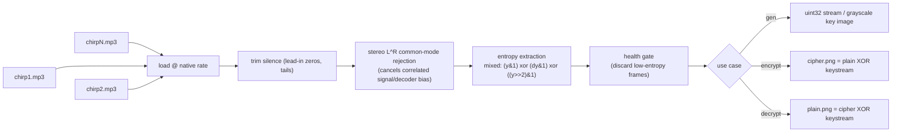

# audio-trng

**True Random Number Generator from natural audio (bird chirps) — with image encryption demo.**

Randomness comes **only** from physical processes in the signal: ADC quantization
noise, environmental noise, and non-stationary content. There is **no
cryptographic conditioning** (no SHA-256) anywhere in the pipeline. Instead,
the **method** itself does the work — stereo common-mode rejection, a mixed
physical extractor, and a source health gate (which *discards* bad audio, never
transforms data). The output passes frequency, runs, autocorrelation and
byte-uniformity tests on raw bits.

## What it does



## Why no SHA-256?

A hash can turn *anything* (even `"hello"`) into random-looking output — so
conditioning would make the result indistinguishable from a PRNG and the
physical source irrelevant. Here every bit is attributable to the extraction
method. Three things make the raw bits pass:

1. **Common-mode rejection (L⊕R).** Both stereo channels contain the *same*
   tonal signal — piano notes, bird phrases, even the MP3 decoder's
   quantization patterns — which shows up as identical low-bit structure in
   both channels. XOR-ing the digitized samples cancels that correlated
   component and leaves only the uncorrelated per-channel noise. This removed
   a byte-uniformity defect that was otherwise present in long tonal tracks.
2. **Mixed physical extractor** — XOR of three cheap views of the noise:
   raw LSBs, sample-difference LSBs, and the shifted bit plane. Any bias
   present in a single view cancels across views.
3. **Health gate** — a NIST SP 800-90B-style check that discards whole audio
   frames whose extracted bytes are statistically non-uniform (|z| > zlim).
   It never alters or expands data; it only refuses to emit low-entropy
On the bundled source pool (`chirp.mp3`, a 5-min bird-chirp field recording,
plus `tokyo.mp3`, a 52-min piano track) the default pipeline reports:

```text
monobit:    PASS   (P(1) = 0.5000)
runs:       PASS
autocorr:   PASS
uniformity: PASS   (z = +1.30 on a 14 MB stream)
min-entropy 7.98 bits/byte (out of 8.0)
```

## Install & run

```bash
uv sync
# random numbers  (default: native rate, L^R stereo, mixed extractor, health gate)
uv run python main.py gen chirp1.mp3 chirp2.mp3 ... --test -c 16

# 512x512 random image (~40s of bird audio is enough)
uv run python main.py gen chirp1.mp3 chirp2.mp3 --test --image random.png

# encrypt an image with the audio-derived keystream
uv run python main.py encrypt chirp1.mp3 chirp2.mp3 -i photo.png -o cipher.png

# decrypt (same audio files + same flags = same keystream)
uv run python main.py decrypt chirp1.mp3 chirp2.mp3 -i cipher.png -o recovered.png
```

Pass several mp3 files for a bigger entropy pool. Throughput is honest:
roughly **32 kbits/s (4 KB/s) of clean entropy** for this pool. Natural
field recordings (birds, ambience) yield far more clean entropy per minute
than studio music, whose tonal content the health gate correctly rejects.

## CLI

```text
main.py {gen,encrypt,decrypt}

gen      input...              -> uint32 stream, optional image / raw bytes
encrypt  input... -i IMG -o    -> cipher.png       (+ --key-image visualization)
decrypt  input... -i IMG -o    -> recovered plain.png

shared extraction options:
  -m, --method   mixed | lsb | diff | adc_noise | zero_cross   (default mixed)
  -n, --nbits    bits per sample (1-4)                         (default 1)
  --highpass     butterworth highpass cutoff Hz                 (default 0 off)
  --debias       von Neumann debiasing (halves data volume)
  --sr           sample rate Hz (0 = native file rate, default)
  --no-xor       disable stereo L^R common-mode rejection
  --no-gate      disable the health gate
  --gate-block   gate block size in bits (default 16384)
  --gate-z       gate uniformity threshold (default 1.0)
```

`gen` extras: `-c N` print N uint32s · `--test` run randomness tests ·
`--image f.png [--image-size W H]` · `--out random.bin` · `--repcheck` ·
`--metadata` print mp3 fingerprint (info only).

## Entropy extraction

For a 16-bit sample `0b0011010100101101`, the upper bits carry the chirp shape;
the lowest bits carry ADC/environmental noise. `mixed` XORs three complementary
physical views per sample so bias in any single view cancels.

Two caveats the health gate exists for:

- **Tonal music** (piano, etc.) has near-periodic low-bit patterns — the bytes
  are locally non-uniform, and that shows even though P(1) ≈ 0.5. The gate
  drops those source frames; a piano-heavy pool therefore yields less usable
  entropy per minute.
- **Stereo channels share the same tone + decoder patterns** (common-mode). A
  simple channel concatenation accumulates that shared bias; L⊕R removes it.

## Image encryption (paper-style)

XOR once per byte with the audio keystream (as in the image-encryption papers
this project references). Demo metrics (512×512 grayscale, `chirp+tokyo`):

| metric | result | ideal |
|---|---|---|
| plain ⇄ cipher correlation | **+0.0010** | 0 |
| cipher byte uniformity z | **−0.50** | \|z\| < 3 |
| cipher min-entropy | **7.89 bits/byte** | 8.0 |

The keystream is a deterministic function of the audio files + extraction
flags, so `decrypt` reproduces it exactly. Different audio or different flags
produce a different keystream and the original image **cannot** be recovered
(verified: wrong `-m` predicate ⇒ `MISMATCH`). Roundtrips are byte-identical
for both grayscale and RGB images.

## Repo layout

```
main.py       # CLI: gen / encrypt / decrypt
chirp.mp3     # sample source (gitignored — supply your own recordings)
demo/         # plain / cipher / key / recovered demo images
pyproject.toml
```

## Limitations

- Output volume is bounded by source entropy: silence is trimmed, tonal
  stretches are dropped by the health gate, and requesting more keystream than
  the pool provides is a hard error (the message quantifies how much more audio
  is needed).
- `zero_cross` / `lsb` / `adc_noise` are weak alone — use the default `mixed`
  or `diff`, or add `--debias`.
- Music sources intentionally yield less clean entropy than field recordings —
  this is the gate working as designed, not a bug.
- Plain XOR is a demonstrative cipher (how the referenced papers wire it), not
  a construction to ship for production use.