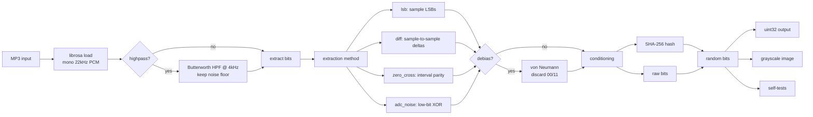
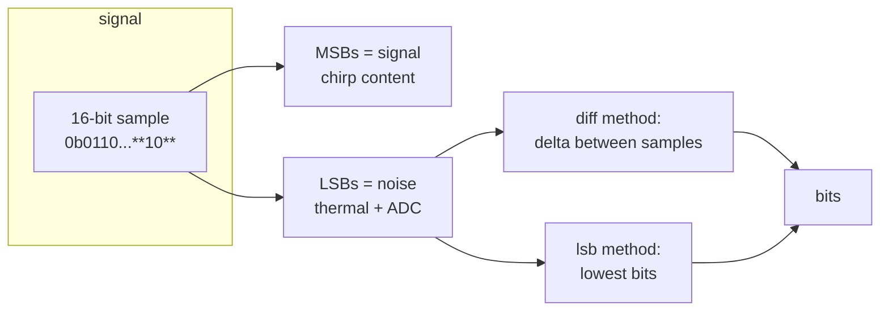
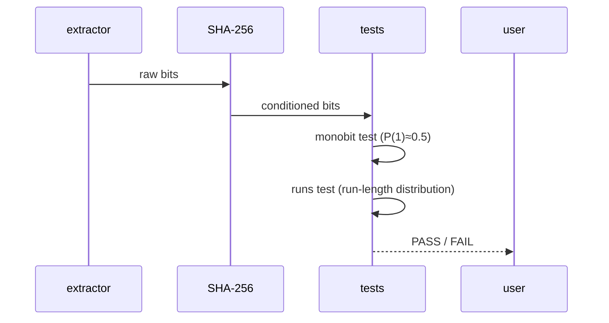

# audio-trng

Generate **true random numbers** from the entropy hidden in natural audio recordings (e.g. bird chirps). No PRNG seeds — randomness comes from ADC quantization noise, environmental noise, and non-deterministic signal content.

## What this does

```
bird chirp.mp3 ──► entropy extraction ──► debias / condition ──► random bits
                                                              ├─► uint32 stream
                                                              ├─► 512×512 grayscale image
                                                              └─► NIST SP 800-22 self-tests
```

## Why audio works as entropy source

- **ADC quantization noise** — the lowest 1–2 bits of every 16-bit sample are sub-bit electrical noise, not signal
- **Environmental noise** — microphone thermal hiss, air pressure fluctuations
- **Non-stationary signal** — a bird chirp is aperiodic and frequency-modulated, unlike a computer-generated tone
- **MP3 lossy artifacts** — encoder psychoacoustic decisions are content-dependent and non-reproducible

## Quick start

```bash
uv sync
uv run python main.py chirp.mp3 -m diff --debias --hash --test
```

## Usage

```bash
uv run python main.py chirp.mp3 -n 2 -m diff --highpass 4000 --debias --hash \
    --test --metadata --image random.png --repcheck -c 16
```

| Flag | Default | Purpose |
|---|---|---|
| `input` | — | audio file(s); pass multiple to merge entropy |
| `-n` | `1` | bits per sample to extract (1–16) |
| `-m` | `diff` | extraction method: `lsb`, `diff`, `zero_cross`, `adc_noise` |
| `-c` | `256` | number of 32-bit integers to output |
| `--highpass` | `0` | HPF cutoff Hz; strips structured content, keeps noise floor |
| `--debias` | off | von Neumann debiasing (removes bias, discards ~50% bits) |
| `--hash` | off | SHA-256 conditioning (cryptographic entropy extraction) |
| `--test` | off | NIST SP 800-22-style monobit + runs tests |
| `--seed` | — | extra seed string mixed into conditioner |
| `--metadata` | off | hash MP3 metadata (bitrate/samplerate/ID3 tags) as seed |
| `--image` | — | save random bytes as grayscale image (e.g. `random.png`) |
| `--image-size` | `512 512` | image dimensions W×H |
| `--repcheck` | off | scan output for repeated 16-byte windows |

## Pipeline



## Entropy extraction methods



## How entropy is extracted

For a 16-bit sample `0b0011010100101101`:
- **Upper bits** carry the signal (the chirp shape)
- **Lower bits** carry noise (ADC + environmental)

The `diff` method looks at `sample[i] - sample[i-1]` — instantaneous voltage fluctuation, dominated by physical noise rather than chirp content.

The highpass filter (`--highpass 4000`) strips the structured 1–4kHz bird song, leaving mostly electronic noise floor as entropy.

## Randomness validation

Runs NIST SP 800-22-style tests:



- **Monobit** — proportion of 1s close to 0.5 (`|stat| < 3.29`)
- **Runs** — sequences of consecutive identical bits match expected distribution
- **Repetition check** — no repeated 16-byte windows (non-periodicity)

## Output as image

```bash
uv run python main.py chirp.mp3 -m diff --debias --hash --image random.png
```

Packs random bits into bytes → arranges as 512×512 array → grayscale PNG.
A good TRNG output looks like uniform TV static; any visible structure = bias.

## Multiple inputs

```bash
uv run python main.py chirp.mp3 ambience.mp3 -m diff --debias --hash --test
```

Concatenates waveforms — larger entropy pool dilutes any single-file artifacts.

## Validation run (this repo)

```
monobit: stat=1.6250  PASS
runs:    stat=0.3385  PASS
P(1) = 0.4492  (ideal: 0.5)
no repeated 16-byte windows
```

## Architecture

```
├── main.py        # CLI + pipeline
├── chirp.mp3      # sample entropy source
├── random.png     # generated output (512×512 grayscale)
├── diagrams/      # architecture diagrams
└── pyproject.toml # uv project
```

## Limitations

- Highpass + debiasing + hashing needed for reliable statistical pass; raw LSB bits alone are weakly biased
- `zero_cross` method alone fails statistical tests (use with `--hash`)
- Output is as good as the entropy source — a silent or synthetic (tone) input yields poor randomness

## Dependencies

librosa · numpy · scipy · soundfile · mutagen · Pillow · matplotlib
